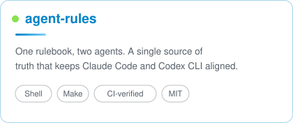
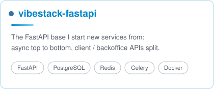

 

 

<table width="100%">
<tr>
<td width="55%" valign="top">

## 🙋 About Me

- 🔭 Working on **backend services** and **AI-agent tooling**
- 🚀 I ship my open source under [**VibeStack-AI**](https://github.com/VibeStack-AI) — see below
- 🌱 Deep-diving into **LangChain / LangGraph**, RAG pipelines, and multi-agent systems
- ⚙️ I automate everything that gets repeated twice
- 💬 Ask me about Python automation, LLM apps, and dev workflows

</td>
<td width="45%" valign="top">

## 🧰 Tech Stack

**Languages**

**Frameworks & Tools**

</td>
</tr>
</table>

## 🚀 [VibeStack-AI](https://github.com/VibeStack-AI)

The org where I keep the tools I actually use every day.

<table width="100%">
<tr>
<td width="50%" valign="top">

- Single source of truth in `rules/core.md`; `make sync` generates both platform files and CI fails if they drift.
- `make install` symlinks `~/.claude/CLAUDE.md` and `~/.codex/AGENTS.md`, backing up whatever was there.
- `--dry-run`, `make status`, `make diff`, `make uninstall` — every step is reversible.

</td>
<td width="50%" valign="top">

- Client and backoffice APIs are separate, each with its own Swagger and ReDoc, gated by `ENV`.
- Async all the way down: FastAPI, SQLAlchemy 2.0 async, Celery, on Postgres and Redis.
- JWT auth, Alembic migrations, S3 and SMTP wired in; `docker-compose up -d` runs the whole stack.

</td>
</tr>
</table>

## 📊 GitHub Stats

  

## 🐍 Contribution Snake

<picture>
  <source media="(prefers-color-scheme: dark)" srcset="https://raw.githubusercontent.com/wujuncheng-dev/wujuncheng-dev/output/github-snake-dark.svg" />
  
</picture>

✨ Thanks for stopping by — have a nice day! ✨

